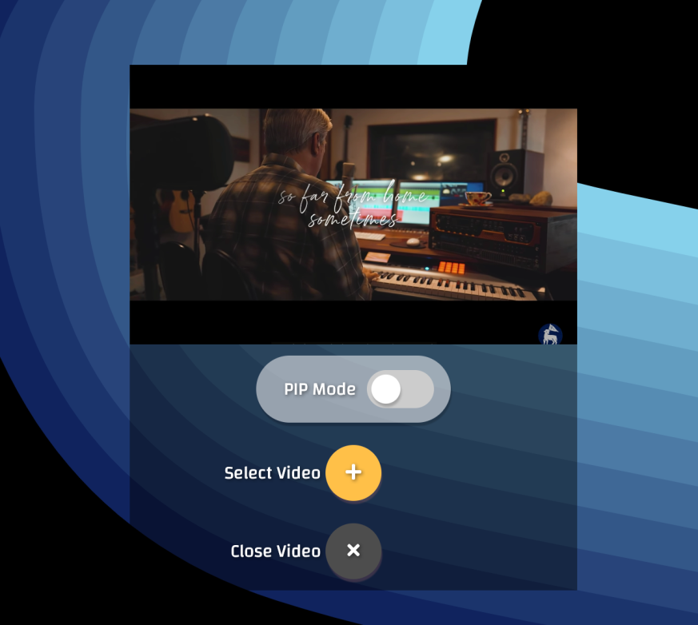
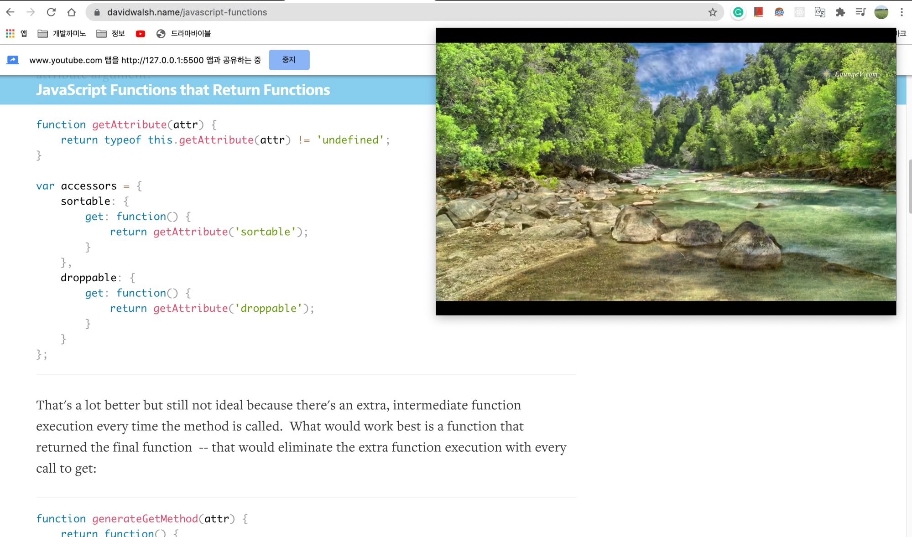

# picture-in picture

  - Built with HTML, CSS and Javascript.
  - using MediaStream API
  - using PictureInPicture API 
  
  
referenced ideas and codes from the ZMT JS course

[course-link](https://academy.zerotomastery.io/p/javascript-projects)

---
## feature
- get a video stream from brower media list.
- show video in Picture in Picture(PIP) mode
- can toggle PIP state and stop stream
---
## How to use

**button function**
- PIP mode: change to Picture In Picture mode by PIP mode toggle button
 - select video : choose a video among your media list.
   -  you can change after by click this button agian 
- close video : stop video stream
  
  [live server here]()
---
## When to use?

I would use in this ways...
-  turn on PIP mode of tutorial video and search and code together! 
- when listen music with beatiful landscape video
- etc ...!  

---
## check support
- check brower support for picture-in-picture API, MediaStream
  
  [Picture-in-Picture support table](https://caniuse.com/#feat=picture-in-picture)

  [MediaStream support table](https://caniuse.com/#feat=mdn-api_mediastream)
---